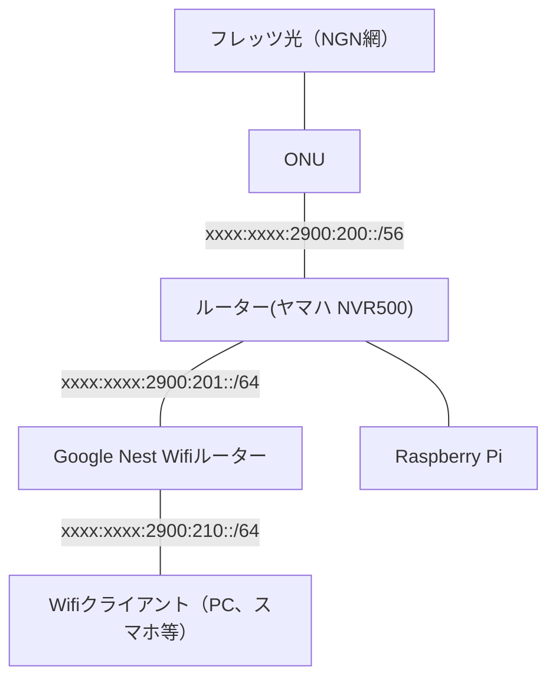

# はじめに

一般的なWifi AP専用機がブリッジモードで動作するのと異なり、Google Nest Wifi（旧製品のGoogle Wifi含む）は、デフォルトでルーターモードで動作します。
ほぼ素通しのブリッジモードと違い、ルーターモードの場合は利用するIPv6ネットワークの割り当てが必要になるため、フレッツ光接続しているルーター配下にGoogle Nest Wifiを接続した場合、IPv6を使うにはちょっと面倒な設定が必要になります。

ブリッジモードで動作させることも可能ですが、その場合はメッシュネットワークやファミリーWi-Fiなど、Google Nest Wifiならではの機能を使うことができません。
せっかくならばフル機能のGoogle Nest Wifi環境でIPv6を使いたいものです。このArticleではその方法の一例を解説します。

ちなみに、ちょっと面倒なのはIPv6を使うときだけで、Wifiクライアント（スマートフォンなど）からIPv4ネットワークに接続するだけならば、ほぼPlug and Playで使えます。

# ざっくり言うと

Google Nest WifiルーターおよびGoogle WifiルーターでIPv6を使うには、以下の要件を満たす必要があります。
- DHCPv6で、Google Nest WifiルーターWAN側I/FのIPv6アドレスを割り当てる
- DHCPv6-PDで、Google Nest WifiルーターがLAN側で広告するIPv6ネットワークを配布する
- フレッツ光側ルーターのIPv6設定で、Google Nest Wifiルーターに配布したIPv6ネットワークへのルーティングをする

これらの要件を満たすためには以下の必要があります。
- ひかり電話を契約する（/56を受け取るため）
- NGN網から受け取った/56から一部をDHCPv6-PDで配る環境を作る

今回使うルーター(YAMAHA NVR500)にはDHCPv6-PDのサーバー機能がないので、[Kea DHCP server](https://kea.isc.org/)というDHCPv6-PDに対応したDHCPサーバーを使って、Google Nest WifiルーターにIPv6アドレスを配布しIPv6 readyな環境を整えます。

# 詳しく言うと

Google Nest WifiがIPv6接続する要件は [IPv6](https://support.google.com/googlenest/answer/6361450?hl=en) のヘルプページに説明されています。日本語ページは"prefix"を「接頭辞」と翻訳していたりして読みづらいので、英語ページから引用します。

> When IPv6 is enabled on Google Nest Wifi or Google Wifi, it uses the DHCPv6 protocol on its WAN port to request an address from your ISP.

Google Nest WifiまたはGoogle WifiでIPv6を有効にした場合、WANポート側でDHCPv6を使ってアドレスを取得します。
（このあとの文章で、DHCPv6がない場合はIPv6アドレス自動設定(SLAAC)を使ってIPv6アドレスの取得を試行するという記載がありますが、試したことがないので割愛します）

> The router also requests an IPv6 prefix from the ISP, which is used to send the IPv6 router advertisements to the clients on the LAN, to allow them to derive their own addresses.

ルーターがIPv6アドレスを取得した後、ISPに対して（WAN側で）LAN側クライアントに広告するIPv6 prefixを要求します。

> If the ISP provides a usable prefix, Google Nest Wifi and Google Wifi will start sending IPv6 routing advertisements to clients on the LAN to allow them to pick and validate their own IPv6 addresses using the SLAAC (or “slack”) procedure.

ISPが（WAN側から）有効なprefixを得られた場合、Google Nest WifiまたはGoogle WifiはLAN側のクライアントにIPv6ルーター広告を送信し、クライアントがSLAAC（アドレス自動設定）でIPv6アドレスを得られるようになります。

つまりは、WAN側からDHCPv6でGoogle Nest WifiのWAN側I/FのIPv6アドレスを割り当て、DHCPv6-PDでGoogle Nest WifiのLAN側に広告するアドレスを配布すれば良いわけです。

# 検証環境

- フレッツ光ネクスト（ひかり電話契約あり）
- ヤマハ NVR500
- Raspberry Pi 3 Model B+
- Kea DHCP server (https://kea.isc.org/)
- Google Nest Wifiルーター (Model:H2D)
  - Google Wifiルーター (Model:AC-1304)でも同様の構成でIPv6できることを確認済みです

# 構成



# 手順

1. フレッツ光側のルーターで /54 を受けて、LAN側にサブネット出す
2. Google Nest WifiのMACアドレスを調べる（本体の裏に書いてある）
3. Kea DHCPサーバーの設定をする
4. フレッツ光側のルーターにルーティング設定する
5. Google Nest WifiのIPv6を有効にする

# フレッツ光側のルーター(NVR500)設定

LAN1にLAN、LAN2にWAN（フレッツ光のONU）が接続されているとします。
lan1はDHCPv6でアドレス配布するので、ルーター広告に `m_flag=on o_flag=on` をつけること以外は、一般的なヤマハルーターRTX/NVRシリーズの設定と同じです。

参考: [フレッツ光ネクスト インターネット(IPv6 IPoE)接続＋ひかり電話](https://network.yamaha.com/setting/router_firewall/flets/flets_other_service/ipv6_ipoe-nvr500)


```
ipv6 prefix 1 dhcp-prefix@lan2::1:0:0:0:1/64
ipv6 lan1 address dhcp-prefix@lan2::1:0:0:0:1/64
ipv6 lan1 rtadv send 1 m_flag=on o_flag=on
ipv6 lan2 address dhcp
ipv6 lan2 dhcp service client
ipv6 route default gateway dhcp lan2
```

# Kea DHCPサーバーの設定をする

Debian系Linuxでは以下のパッケージをインストールすればOKです。

```
$ sudo apt update
$ sudo apt install kea-dhcp4-server kea-dhcp6-server
```

## kea-dhcp6-server

Keaの設定はJSONファイルで記述します。
キモになる部分は `Dhcp6.subnet6[].reservations[].prefixes[]` の部分で、ここにGoogle Wifiルーターに配布するIPv6ネットワークのプレフィックスを記載します。

以下の例では `xxxx:xxxx:2900:210::/64` を配布していますが、ゲストネットワークでもIPv6を使いたい場合は、ここを/64より短いプレフィックス（/63とか）にする必要があります。
参考: [IPv6（Google Nest Wifiヘルプ）](https://support.google.com/googlenest/answer/6361450?hl=en)

:::details 該当箇所
> IPv6 on guest network
> Google Nest Wifi and Google Wifi support IPv6 on all LAN connections, including wired LAN and private WLAN. Google Nest Wifi and Google Wifi also support guest networking for IPv6, however your ISP must provide a network prefix length that’s less than 64 bits to allow for proper subnet addressing. If the ISP’s prefix is 64 bits, IPv6 won’t be available on the guest network.

Google Nest WifiおよびGoogle Wifiは有線ポートと無線含めた全てのLAN接続でIPv6をサポートしている。ゲストネットワークでもIPv6をサポートしているが、その場合はISPは64ビットよりも短いprefixでサブネットを割り当てる必要がある。prefixが64ビットの場合はゲストネットワークでIPv6はサポートされない。
:::

### コマンド例

```
$ sudo vi /etc/kea/kea-dhcp6.conf
$ sudo systemctl start kea-dhcp6-server.service
```

### 設定ファイル例

```json:/etc/kea/kea-dhcp6.conf
{
  "Dhcp6": {
    "interfaces-config": {
      "interfaces": ["eth0"]
    },

    "lease-database": {
      "type": "memfile",
      "lfc-interval": 3600,
      "name": "/var/lib/kea/kea-leases6.csv"
    },

    "renew-timer": 7200,
    "rebind-timer": 10800,
    "preferred-lifetime": 12600,
    "valid-lifetime": 14400,

    "option-data": [
      // 例: フレッツのNTPサーバーを使用
      { "name": "sntp-servers", "data": "2404:1a8:1102::a, 2404:1a8:1102::b" }
    ],

    "subnet6": [
      {
        // フレッツから配布されてきたIPv6ネットワーク
        "subnet": "xxxx:xxxx:2900:200::/56",
        "interface": "eth0",
        "pools": [
          // DHCPv6で配布するIPv6アドレス
          { "pool": "xxxx:xxxx:2900:201::1000-xxxx:xxxx:2900:201::f000" }
        ],

        "reservations": [
          {
            // Google Nest WifiルーターのMACアドレス
            "hw-address": "24:05:88:aa:bb:cc",
            // DHCPv6で割り当てるIPv6アドレス
            "ip-addresses": ["xxxx:xxxx:2900:201::10"],
            // DHCPv6-PDで配布するIPv6 prefix
            // このIPv6ネットワークがWifi配下のクライアントに割り当てられる
            "prefixes": ["xxxx:xxxx:2900:210::/64"]
          }
        ]
      }
    ]
  },
  "Logging": {
    "loggers": [
      {
        "name": "kea-dhcp6",
        "output_options": [
          {
            "output": "/var/log/kea-dhcp6.log"
          }
        ],
        "severity": "DEBUG",
        // DEBUGの場合、debuglevelの値が大きいほどログが詳細になる
        "debuglevel": 20
      }
    ]
  }
}
```

## kea-dhcp4-server

この設定例では、DHCPv4のアドレス配布もKea DHCPサーバーで行なっています。これは必須の構成ではなく、ルーターでIPv4アドレスの配布をしても問題ないと思います。

### コマンド例

```
$ vi /etc/kea/kea-dhcp4.conf
$ sudo systemctl start kea-dhcp4-server.service
```

### 設定ファイル例

```json:/etc/kea/kea-dhcp4.conf
{
  "Dhcp4": {
    "interfaces-config": {
      // 例: eth0でDHCPを聞く
      "interfaces": ["eth0"]
    },
    "lease-database": {
      "type": "memfile",
      "lfc-interval": 3600
    },
    "option-data": [
      {
        // 例： CISCO UmbrellaのDNSサーバーを指定
        "name": "domain-name-servers",
        "data": "208.67.222.222, 208.67.220.220"
      },
      {
        // 例： Internet MultifeedのNTPを指定
        "name": "ntp-servers",
        "data": "210.173.160.87, 210.173.160.57, 210.173.160.27"
      }
    ],
    "subnet4": [
      {
        "subnet": "192.168.90.0/24",
        // アドレス配布範囲
        "pools": [{ "pool": "192.168.90.100 - 192.168.90.249" }],
        "option-data": [
          {
            "name": "routers",
            "data": "192.168.90.1"
          }
        ]
      }
    ]
  },
  "Logging": {
    "loggers": [
      {
        "name": "kea-dhcp4",
        "output_options": [
          {
            "output": "/var/log/kea-dhcp4.log"
          }
        ],
        "severity": "INFO",
        "debuglevel": 0
      }
    ]
  }
}
```

# フレッツ光側のルーターにルーティング設定する

まず、Google Nest WifiルーターのMACアドレスから、IPv6のリンクローカルアドレスを計算しておきます。（計算するサイトはググれば出てきます）

DHCPv6-PDで配布したprefixのゲートウェイに、計算しておいたGoogle Nest Wifiのリンクローカルアドレスを指定します。
リンクローカルアドレスを使う場合、アドレスの最後にI/Fを指定する `%lan1` をつけるのを忘れずに。

```
ipv6 route xxxx:xxxx:2900:210::/64 gateway fe80::7ed9:aaff:fbbe:cc02%lan1
```

# Google Nest WifiのIPv6を有効にする

ようやくGoogle Nest WifiでIPv6を有効にする準備ができました。IPv6を有効にするには以下の順でGoogle Homeアプリを操作します。

Google Homeアプリ開く → Wi-Fi → 設定アイコン → ネットワークの詳細設定 → IPv6を有効

しばらく待ってkeaのログファイルに `ALLOC_ENGINE_V6_HR_PREFIX_GRANTED` が出れば成功です。

```
2021-07-21 00:02:08.031 INFO  [kea-dhcp6.alloc-engine/4970] ALLOC_ENGINE_V6_HR_PREFIX_GRANTED reserved prefix xxxx:xxxx:2900:210::/64 was assigned to client duid=[xxxxx], tid=0xfffff
```

おつかれさまでした。
